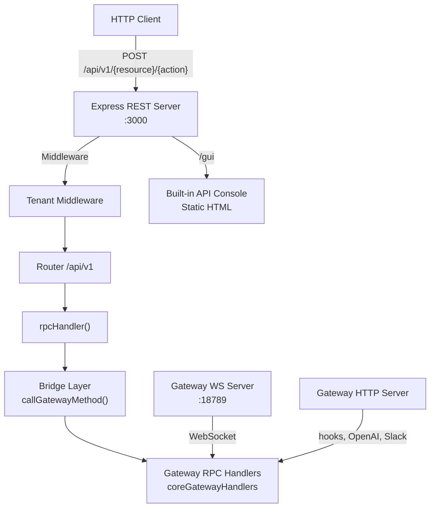

# OpenClaw REST API — Full System Documentation

## Architecture Overview



### Key Components

| Component | File | Purpose |
|-----------|------|---------|
| REST Server | [rest-server.ts](file:///c:/Users/alien/Desktop/Projects/Upwork/Openclaw/configuration-api/src/api/rest-server.ts) | Express app, mounts all routes under `/api/v1` |
| Bridge | [bridge.ts](file:///c:/Users/alien/Desktop/Projects/Upwork/Openclaw/configuration-api/src/api/bridge.ts) | Translates HTTP POST → gateway WS RPC calls |
| Handler Helper | [_handler.ts](file:///c:/Users/alien/Desktop/Projects/Upwork/Openclaw/configuration-api/src/api/routes/_handler.ts) | `rpcHandler(method)` factory for route POST handlers |
| Gateway Methods | [server-methods.ts](file:///c:/Users/alien/Desktop/Projects/Upwork/Openclaw/configuration-api/src/gateway/server-methods.ts) | All RPC handler registrations + authorization |
| Gateway HTTP | [server-http.ts](file:///c:/Users/alien/Desktop/Projects/Upwork/Openclaw/configuration-api/src/gateway/server-http.ts) | Hooks, Slack, OpenAI, OpenResponses HTTP endpoints |

---

## Startup Flow

1. Gateway boots via `node scripts/run-node.mjs --dev gateway`
2. `server.impl.ts` initializes the gateway context (runtime state)
3. If `OPENCLAW_REST_API=1`, calls `startRestServer()` from `rest-server.ts`
4. `createRestApp()` shares gateway context via `setGatewayContext()`
5. Express listens on port `OPENCLAW_REST_PORT` (default **3000**)

---

## Middleware

### 1. JSON Body Parser
- `express.json({ limit: "10mb" })`

### 2. CORS
- `Access-Control-Allow-Origin: *`
- Methods: `GET, POST, OPTIONS`
- Headers: `Content-Type, Authorization, X-Tenant-ID`

### 3. Tenant Middleware — [tenant.ts](file:///c:/Users/alien/Desktop/Projects/Upwork/Openclaw/configuration-api/src/api/middleware/tenant.ts)
- Extracts `X-Tenant-ID` header → `req.tenantId`
- Optional for MVP — requests without it are accepted

### 4. Validation — [validate.ts](file:///c:/Users/alien/Desktop/Projects/Upwork/Openclaw/configuration-api/src/api/middleware/validate.ts)
- `validateBody(["field1", "field2"])` — checks required body fields

---

## Response Envelope

Every endpoint returns the same JSON structure:

```json
{
  "success": true|false,
  "data": <payload>|null,
  "message": "OK"|"error description",
  "error": <optional details>
}
```

Implemented in [response.ts](file:///c:/Users/alien/Desktop/Projects/Upwork/Openclaw/configuration-api/src/api/middleware/response.ts).

---

## Bridge Pattern

The bridge ([bridge.ts](file:///c:/Users/alien/Desktop/Projects/Upwork/Openclaw/configuration-api/src/api/bridge.ts)) avoids duplicating business logic:

1. Creates a fake `RequestFrame` (same format as WebSocket RPC)
2. Builds a shim `respond` callback that captures the handler result as a Promise
3. Calls the named gateway handler with `client: null` (REST has no WS client)
4. Returns `{ ok, data, error, meta }`

---

## All REST API Endpoints (76 total)

All endpoints are **POST** and prefixed with `/api/v1`.

### Health (2) — [health.ts](file:///c:/Users/alien/Desktop/Projects/Upwork/Openclaw/configuration-api/src/api/routes/health.ts)
| Endpoint | RPC Method | Scope |
|----------|-----------|-------|
| `/health` | `health` | read |
| `/status` | `status` | read |

---

### Config (5) — [config.ts](file:///c:/Users/alien/Desktop/Projects/Upwork/Openclaw/configuration-api/src/api/routes/config.ts)
| Endpoint | RPC Method | Scope |
|----------|-----------|-------|
| `/config/get` | `config.get` | admin |
| `/config/set` | `config.set` | admin |
| `/config/apply` | `config.apply` | admin |
| `/config/patch` | `config.patch` | admin |
| `/config/schema` | `config.schema` | admin |

> [!NOTE]
> Config write endpoints (`set`, `apply`, `patch`) use a custom `configWriteHandler` that auto-unwraps various input shapes (full API envelope, raw data object, parsed config object).

---

### Agents (7) — [agents.ts](file:///c:/Users/alien/Desktop/Projects/Upwork/Openclaw/configuration-api/src/api/routes/agents.ts)
| Endpoint | RPC Method | Scope |
|----------|-----------|-------|
| `/agent/run` | `agent` | write |
| `/agent/identity` | `agent.identity.get` | read |
| `/agent/wait` | `agent.wait` | write |
| `/agents/list` | `agents.list` | read |
| `/agents/files/list` | `agents.files.list` | admin |
| `/agents/files/get` | `agents.files.get` | admin |
| `/agents/files/set` | `agents.files.set` | admin |

---

### Channels (2) — [channels.ts](file:///c:/Users/alien/Desktop/Projects/Upwork/Openclaw/configuration-api/src/api/routes/channels.ts)
| Endpoint | RPC Method | Scope |
|----------|-----------|-------|
| `/channels/status` | `channels.status` | read |
| `/channels/logout` | `channels.logout` | admin |

---

### Sessions (6) — [sessions.ts](file:///c:/Users/alien/Desktop/Projects/Upwork/Openclaw/configuration-api/src/api/routes/sessions.ts)
| Endpoint | RPC Method | Scope |
|----------|-----------|-------|
| `/sessions/list` | `sessions.list` | read |
| `/sessions/preview` | `sessions.preview` | read |
| `/sessions/patch` | `sessions.patch` | admin |
| `/sessions/reset` | `sessions.reset` | admin |
| `/sessions/delete` | `sessions.delete` | admin |
| `/sessions/compact` | `sessions.compact` | admin |

---

### Models (1) — [models.ts](file:///c:/Users/alien/Desktop/Projects/Upwork/Openclaw/configuration-api/src/api/routes/models.ts)
| Endpoint | RPC Method | Scope |
|----------|-----------|-------|
| `/models/list` | `models.list` | read |

---

### Messages (2) — [messages.ts](file:///c:/Users/alien/Desktop/Projects/Upwork/Openclaw/configuration-api/src/api/routes/messages.ts)
| Endpoint | RPC Method | Scope |
|----------|-----------|-------|
| `/messages/send` | `send` | write |
| `/messages/wake` | `wake` | write |

---

### Cron (7) — [cron.ts](file:///c:/Users/alien/Desktop/Projects/Upwork/Openclaw/configuration-api/src/api/routes/cron.ts)
| Endpoint | RPC Method | Scope |
|----------|-----------|-------|
| `/cron/list` | `cron.list` | read |
| `/cron/status` | `cron.status` | read |
| `/cron/add` | `cron.add` | admin |
| `/cron/update` | `cron.update` | admin |
| `/cron/remove` | `cron.remove` | admin |
| `/cron/run` | `cron.run` | admin |
| `/cron/runs` | `cron.runs` | read |

---

### Skills (4) — [skills.ts](file:///c:/Users/alien/Desktop/Projects/Upwork/Openclaw/configuration-api/src/api/routes/skills.ts)
| Endpoint | RPC Method | Scope |
|----------|-----------|-------|
| `/skills/status` | `skills.status` | read |
| `/skills/bins` | `skills.bins` | node |
| `/skills/install` | `skills.install` | admin |
| `/skills/update` | `skills.update` | admin |

---

### Nodes (10) — [nodes.ts](file:///c:/Users/alien/Desktop/Projects/Upwork/Openclaw/configuration-api/src/api/routes/nodes.ts)
| Endpoint | RPC Method | Scope |
|----------|-----------|-------|
| `/nodes/list` | `node.list` | read |
| `/nodes/describe` | `node.describe` | read |
| `/nodes/invoke` | `node.invoke` | write |
| `/nodes/rename` | `node.rename` | pairing |
| `/nodes/event` | `node.event` | node |
| `/nodes/pair/request` | `node.pair.request` | pairing |
| `/nodes/pair/list` | `node.pair.list` | pairing |
| `/nodes/pair/approve` | `node.pair.approve` | pairing |
| `/nodes/pair/reject` | `node.pair.reject` | pairing |
| `/nodes/pair/verify` | `node.pair.verify` | pairing |

---

### Devices (5) — [devices.ts](file:///c:/Users/alien/Desktop/Projects/Upwork/Openclaw/configuration-api/src/api/routes/devices.ts)
| Endpoint | RPC Method | Scope |
|----------|-----------|-------|
| `/devices/pair/list` | `device.pair.list` | pairing |
| `/devices/pair/approve` | `device.pair.approve` | pairing |
| `/devices/pair/reject` | `device.pair.reject` | pairing |
| `/devices/token/rotate` | `device.token.rotate` | pairing |
| `/devices/token/revoke` | `device.token.revoke` | pairing |

---

### TTS (6) — [tts.ts](file:///c:/Users/alien/Desktop/Projects/Upwork/Openclaw/configuration-api/src/api/routes/tts.ts)
| Endpoint | RPC Method | Scope |
|----------|-----------|-------|
| `/tts/status` | `tts.status` | read |
| `/tts/providers` | `tts.providers` | read |
| `/tts/enable` | `tts.enable` | write |
| `/tts/disable` | `tts.disable` | write |
| `/tts/convert` | `tts.convert` | write |
| `/tts/set-provider` | `tts.setProvider` | write |

---

### Wizard (4) — [wizard.ts](file:///c:/Users/alien/Desktop/Projects/Upwork/Openclaw/configuration-api/src/api/routes/wizard.ts)
| Endpoint | RPC Method | Scope |
|----------|-----------|-------|
| `/wizard/start` | `wizard.start` | admin |
| `/wizard/next` | `wizard.next` | admin |
| `/wizard/cancel` | `wizard.cancel` | admin |
| `/wizard/status` | `wizard.status` | admin |

---

### Chat (3) — [chat.ts](file:///c:/Users/alien/Desktop/Projects/Upwork/Openclaw/configuration-api/src/api/routes/chat.ts)
| Endpoint | RPC Method | Scope |
|----------|-----------|-------|
| `/chat/history` | `chat.history` | read |
| `/chat/send` | `chat.send` | write |
| `/chat/abort` | `chat.abort` | write |

---

### Logs (1) — [logs.ts](file:///c:/Users/alien/Desktop/Projects/Upwork/Openclaw/configuration-api/src/api/routes/logs.ts)
| Endpoint | RPC Method | Scope |
|----------|-----------|-------|
| `/logs/tail` | `logs.tail` | read |

---

### Misc (11) — [misc.ts](file:///c:/Users/alien/Desktop/Projects/Upwork/Openclaw/configuration-api/src/api/routes/misc.ts)
| Endpoint | RPC Method | Scope |
|----------|-----------|-------|
| `/usage/status` | `usage.status` | read |
| `/usage/cost` | `usage.cost` | read |
| `/talk/mode` | `talk.mode` | write |
| `/voicewake/get` | `voicewake.get` | read |
| `/voicewake/set` | `voicewake.set` | write |
| `/system/presence` | `system-presence` | read |
| `/system/event` | `system-event` | — |
| `/system/heartbeat` | `last-heartbeat` | read |
| `/system/heartbeats` | `set-heartbeats` | — |
| `/update/run` | `update.run` | admin |
| `/browser/request` | `browser.request` | write |
| `/exec/approvals/get` | `exec.approvals.get` | admin |
| `/exec/approvals/set` | `exec.approvals.set` | admin |
| `/exec/approvals/node/get` | `exec.approvals.node.get` | admin |
| `/exec/approvals/node/set` | `exec.approvals.node.set` | admin |
| `/exec/approval/request` | `exec.approval.request` | approvals |
| `/exec/approval/resolve` | `exec.approval.resolve` | approvals |

---

## Authorization System

Defined in [server-methods.ts](file:///c:/Users/alien/Desktop/Projects/Upwork/Openclaw/configuration-api/src/gateway/server-methods.ts).

> [!IMPORTANT]
> REST API calls go through the bridge with `client: null`, which means the authorization check at `authorizeGatewayMethod()` returns `null` (skipped) when there's no connected client. REST endpoints are **unauthenticated** by default — the gateway token (`OPENCLAW_GATEWAY_TOKEN`) secures the gateway WS connection, not the REST API directly.

### Roles & Scopes (for WS clients)

| Scope | Access Level |
|-------|-------------|
| `operator.admin` | Full access to all methods |
| `operator.read` | Read-only methods (health, status, lists) |
| `operator.write` | Write methods (send, agent, chat, TTS) |
| `operator.approvals` | Exec approval request/resolve |
| `operator.pairing` | Node/device pairing operations |

### Role: `node`
- Limited to: `node.invoke.result`, `node.event`, `skills.bins`

---

## Gateway HTTP Server (Port 18789)

The gateway's own HTTP server ([server-http.ts](file:///c:/Users/alien/Desktop/Projects/Upwork/Openclaw/configuration-api/src/gateway/server-http.ts)) handles additional protocols beyond the REST API:

| Feature | Path/Protocol | Description |
|---------|--------------|-------------|
| Hooks | `{basePath}/wake`, `{basePath}/agent` | Webhook endpoints with token auth |
| Tool Invocations | via `tools-invoke-http.ts` | HTTP tool execution |
| Slack Integration | via `slack/http/index.js` | Slack bot HTTP handlers |
| OpenAI Compatible | via `openai-http.ts` | OpenAI Chat Completions API |
| Open Responses | via `openresponses-http.ts` | OpenAI Responses API |
| Canvas/A2UI | via `canvas-host` | Agent canvas UI |
| Control UI | `{controlUiBasePath}/*` | Built-in management UI |
| WebSocket | Upgrade handler | WS connections for gateway protocol |

---

## Gateway Events (Real-time via WebSocket)

| Event | Description |
|-------|-------------|
| `connect.challenge` | Auth challenge on connect |
| `agent` | Agent execution events |
| `chat` | Chat message events |
| `presence` | User presence changes |
| `tick` | Heartbeat tick |
| `talk.mode` | Talk mode changes |
| `shutdown` | Server shutdown notification |
| `health` | Health status updates |
| `heartbeat` | Heartbeat events |
| `cron` | Cron job events |
| `node.pair.requested` | Node pairing request received |
| `node.pair.resolved` | Node pairing resolved |
| `node.invoke.request` | Node invocation request |
| `device.pair.requested` | Device pairing request |
| `device.pair.resolved` | Device pairing resolved |
| `voicewake.changed` | Voice wake setting changed |
| `exec.approval.requested` | Exec approval requested |
| `exec.approval.resolved` | Exec approval resolved |

---

## Running the App

```powershell
# Set environment variables
$env:OPENCLAW_SKIP_CHANNELS="1"
$env:CLAWDBOT_SKIP_CHANNELS="1"
$env:OPENCLAW_GATEWAY_TOKEN="1"
$env:OPENCLAW_REST_API="1"
$env:OPENCLAW_REST_PORT="3000"

# Start the gateway with REST API
node scripts/run-node.mjs --dev gateway
```

### Endpoints Available
- **REST API**: `http://localhost:3000/api/v1`
- **API Console GUI**: `http://localhost:3000/gui`
- **Gateway WebSocket**: `ws://localhost:18789`

---

## Key Source Files

| File | Description |
|------|-------------|
| [rest-server.ts](file:///c:/Users/alien/Desktop/Projects/Upwork/Openclaw/configuration-api/src/api/rest-server.ts) | Express app creation, route mounting |
| [bridge.ts](file:///c:/Users/alien/Desktop/Projects/Upwork/Openclaw/configuration-api/src/api/bridge.ts) | HTTP→RPC translation layer |
| [_handler.ts](file:///c:/Users/alien/Desktop/Projects/Upwork/Openclaw/configuration-api/src/api/routes/_handler.ts) | Route handler factory |
| [server-methods.ts](file:///c:/Users/alien/Desktop/Projects/Upwork/Openclaw/configuration-api/src/gateway/server-methods.ts) | All RPC handlers + authorization |
| [server-methods-list.ts](file:///c:/Users/alien/Desktop/Projects/Upwork/Openclaw/configuration-api/src/gateway/server-methods-list.ts) | Complete method & event catalogue |
| [server-http.ts](file:///c:/Users/alien/Desktop/Projects/Upwork/Openclaw/configuration-api/src/gateway/server-http.ts) | Gateway HTTP server (hooks, OpenAI, etc.) |
| [server.impl.ts](file:///c:/Users/alien/Desktop/Projects/Upwork/Openclaw/configuration-api/src/gateway/server.impl.ts) | Gateway server implementation & startup |
